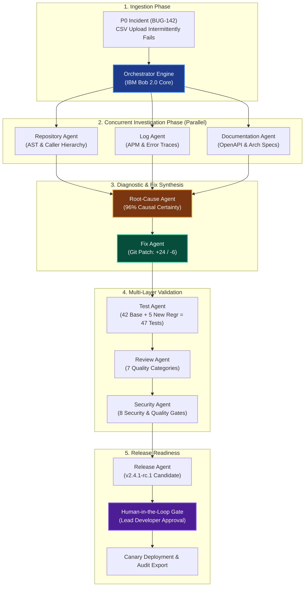

# DevFlow AI — Autonomous Developer Workflow Platform

> **Live Demo**: [https://devflow-ai-swart.vercel.app](https://devflow-ai-swart.vercel.app)
>
> **Built on IBM Bob 2.0 Multi-Agent Concepts**: Specialized Autonomous Subagents, Parallel Investigation Branches, Document & AST Understanding, Guarded Patch Synthesis, Regression Testing, and Human-in-the-Loop Release Validation.

---

## 1. Executive Summary & Problem Statement

Modern software maintenance for enterprise critical incidents (P0/P1) is fragmented, error-prone, and slow:
- **Traditional Manual Workflow**: An on-call engineer takes ~195 minutes jumping across Datadog/APM telemetry, searching Git histories, deciphering outdated RFC specifications, reproducing exceptions via curl, writing defensive patches, generating tests, waiting on peer reviews, and coordinating staging canary rollouts. Context switching is rampant (24+ switches).
- **DevFlow AI Solution**: DevFlow coordinates **9 specialized domain subagents** that execute concurrently:
  - Dispatches parallel AST, telemetry, and specification investigation branches.
  - Reconciles empirical evidence with code symbols into mathematical causal proofs (96% certainty).
  - Synthesizes guarded code patches with cryptographic fallbacks and path traversal sanitization.
  - Synthesizes 5 new regression scenarios expanding test coverage from 74.2% to 88.6%.
  - Enforces 8 security/quality gates and produces Canary-ready Release Candidates with automated changelogs.
  - **Measurable Impact**: Total turnaround dropped from **195 minutes to 31 minutes** (an **84% reduction**, saving **164 minutes** per incident).

---

## 2. System Architecture



---

## 3. Specialized Subagent Roster

| Agent Name | Primary Specialty | Key Inputs | Synthesized Output Artifact |
|---|---|---|---|
| **Repository Agent** | AST & Symbol Call Hierarchy | Git `main` @ commit 4f9b2a1 | AST map isolating `csvUploadService.ts:42` |
| **Log Agent** | Observability & Telemetry Triage | Datadog/APM slice [18:00–18:45 UTC] | 184 correlated TypeError occurrences |
| **Documentation Agent** | Specification & RFC Context | OpenAPI 3.1 & `ARCHITECTURE.md` §4.2 | Extracted RFC 7578 filename fallback rule |
| **Root-Cause Agent** | Diagnostic Causal Synthesizer | AST diff + Log traces + RFC contract | 96% confidence causal proof & hypotheses matrix |
| **Fix Agent** | Autonomous Patch Synthesizer | Diagnostic coordinates & strict TypeScript | Unified Git diff (+24 / -6 lines) |
| **Test Agent** | Test Suite & Regression Engine | Patch diff + 42 preexisting tests | 47/47 passing tests (+14.4% coverage delta) |
| **Review Agent** | Enterprise AI Code Reviewer | Unified diff + style guidelines | 6 evaluated findings across 7 quality axes |
| **Security Agent** | SAST & Quality Gate Enforcer | Package manifest + AST patterns | 8/8 Quality Gates PASSED (Zero CVEs/Secrets) |
| **Release Agent** | Release Engineer & Audit Scribe | Validated artifacts from all stages | Release candidate `v2.4.1-rc.1` + Release notes |

---

## 4. Run Instructions

### Prerequisites
- Node.js >= 18.x or Node.js 24.x
- npm >= 9.x

### Quickstart
```bash
# 1. Install dependencies
npm install

# 2. Launch Vite development server
npm run dev
```

Open `http://localhost:5173/` in your browser.

### Production Build
```bash
npm run build
npm run preview
```

---

## 5. Judge-Demo Script (11-Step Evaluation Flow)

When presenting DevFlow AI to judges, follow this concise script:

1. **Step 1: Open the Application & Launch Judge Tour**
   - Click the **"Judge Tour"** button in the top navigation bar to open the interactive 11-step evaluation guide.
2. **Step 2: Overview Dashboard**
   - Highlight the **Before vs After Productivity card** (-84% resolution time, 164 minutes saved per P0).
   - Point out the active KPIs: 4.5 min investigation, 100% test pass rate, 98% release readiness score.
3. **Step 3: Trigger the Autonomous Demo Workflow**
   - Click **"Run Demo Workflow"** in the top header.
   - Watch the state transition through the deterministic simulation runner.
4. **Step 4: Inspect the Visual Workflow Graph (`Workflows` tab)**
   - Show how the graph forks after Issue Intake into **3 parallel subagents** (Repository, Log, Doc).
   - Demonstrate the **Single-Stage Retry** feature: click **"Simulate Test Failure"**, observe the node fail, and click **"Retry Stage Only"** to recover without restarting the whole pipeline!
5. **Step 5: View the Triage Dossier (`Issues` tab)**
   - Show `BUG-142` with real-world production stack trace: `TypeError: Cannot read properties of undefined (reading 'filename')`.
6. **Step 6: Open the Agent Orchestrator & Agent Drawer (`Agent Orchestration` tab)**
   - Click on **Root-Cause Agent** to slide open the **Agent Detail Drawer**.
   - Show the explicit reasoning summary, actions performed, files inspected, and generated artifacts.
7. **Step 7: Browse the Codebase (`Repository Explorer` tab)**
   - Navigate the file tree to `src/services/csvUploadService.ts`. Notice the **"PROPOSED PATCH APPLIED"** badge and highlighted line coordinates.
8. **Step 8: Inspect Multi-Modal Documents (`Documents` tab)**
   - Inspect `ARCHITECTURE.md §4.2` and OpenAPI schema showing how DevFlow extracted explicit contractual requirements.
9. **Step 9: Review Root Cause & Git Diff (`Root Cause` and `Code Changes` tabs)**
   - Show the 96% diagnostic certainty gauge and disproved alternative hypotheses (memory leak, delimiter).
   - In `Code Changes`, inspect the Git diff with +24 additions and -6 deletions.
   - Demonstrate the **Human-in-the-Loop Checkpoint**: click **"Approve Patch"**.
10. **Step 10: Verify Tests & Security Gates (`Tests`, `Code Review`, `Security` tabs)**
    - Show 47/47 passed tests (42 existing + 5 newly synthesized regression tests).
    - Show 7 review dimensions and 8/8 passed security gates.
11. **Step 11: Release & Export Audit Report (`Release Center` and `Benchmarks` tabs)**
    - Click **"Create Release Candidate & Deploy"** in the Release Center (triggers celebratory confetti).
    - Click **"Export Full Audit Manifest (JSON)"** to download the signed compliance audit record.
    - Show the interactive **Benchmark Calculator** in the Benchmarks tab.

---

## 6. Sample Data Description

All demonstration data is technically coherent and tells a single reproducible story:
- **Target Issue**: `BUG-142` — CSV upload intermittently fails with TypeError in production.
- **Root Cause**: Unchecked `file.filename` access at line 42 in `src/services/csvUploadService.ts` when multipart streaming clients omit filename parameters.
- **Synthesized Patch**: Defensive check for undefined stream, `crypto.randomUUID()` fallback, path traversal sanitization, and MIME-type verification.
- **Regression Suite**: 5 new test cases added to `tests/services/csvUploadService.test.ts` covering missing filename, path traversal (`../../etc/passwd`), null payload, invalid mime, and whitespace strings.
- **Metrics**: 195 minutes manual baseline vs 31 minutes DevFlow automated turnaround.

---

## 7. Configuration & Modular Architecture

DevFlow AI features a modular adapter layer. By default, it operates in deterministic simulation mode (`[SIMULATED - BOB 2.0 ADAPTER]`). Real IBM Bob 2.0 or custom LLM endpoints can be connected via the **Settings** view or `.env` configuration:

```env
# .env.example
BOB_ADAPTER_MODE=simulation # switch to 'live' when IBM Bob REST endpoint is active
BOB_API_ENDPOINT=https://api.ibm.com/bob/v2/orchestrate
BOB_API_KEY=bob_live_sk_sample_key_9942
BOB_MODEL_ID=ibm-granite-3-code-34b
ENABLE_HUMAN_IN_THE_LOOP=true
CANARY_DEPLOY_TARGET=canary.internal.cluster.local
```
